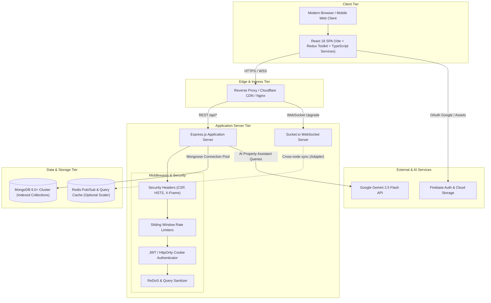
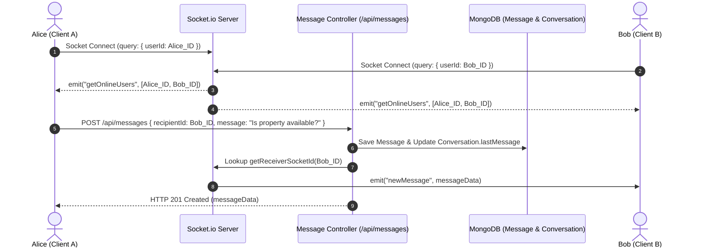
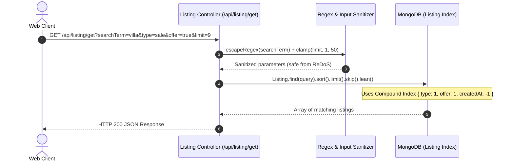
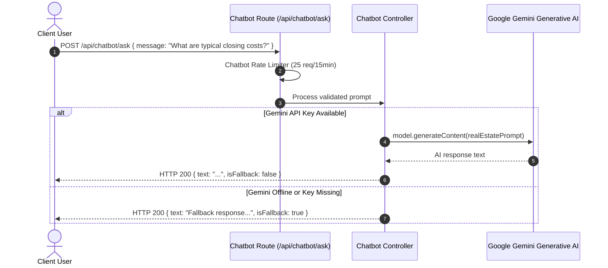
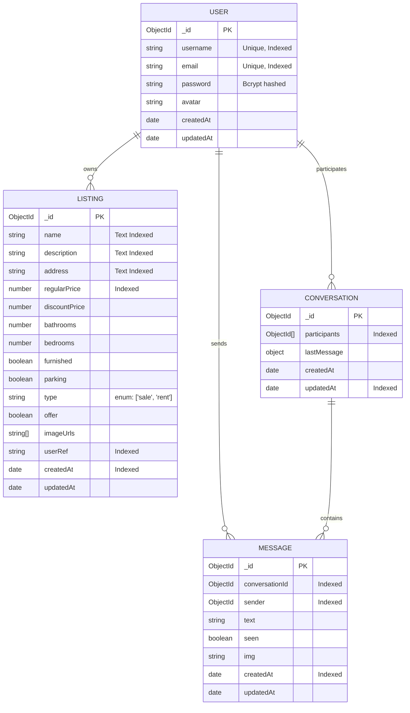
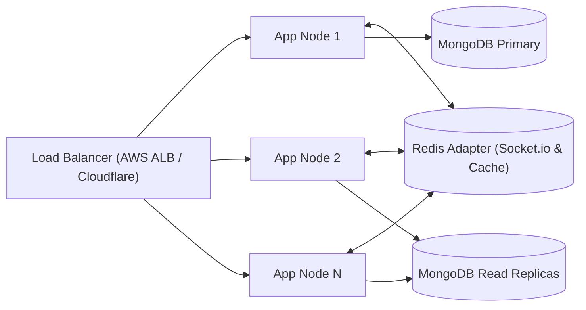

# 🏢 PrimeEstate - Enterprise MERN Real Estate Platform

[](https://nodejs.org/)
[](https://reactjs.org/)
[](https://www.typescriptlang.org/)
[](https://www.mongodb.com/)
[](https://expressjs.com/)
[](https://socket.io/)
[](https://aistudio.google.com/)
[](https://www.docker.com/)
[](LICENSE)

A full-stack, enterprise-grade real estate property listing and marketplace platform built on the MERN stack with **TypeScript type contracts**, real-time direct messaging, intelligent conversational AI property assistance, comprehensive search and filtering, and production-hardened system architecture.

---

## 📑 Table of Contents

- [System Architecture](#-system-architecture)
  - [High-Level Architecture](#high-level-architecture)
  - [Tiered System Design](#tiered-system-design)
  - [Sequence & Data Flow Diagrams](#sequence--data-flow-diagrams)
- [TypeScript Architecture & Contracts](#-typescript-architecture--contracts)
- [Database Schema & Data Models](#-database-schema--data-models)
- [Production Engineering & Security Hardening](#-production-engineering--security-hardening)
- [Scalability & High Availability Strategy](#-scalability--high-availability-strategy)
- [API Reference](#-api-reference)
- [Environment Configuration](#-environment-configuration)
- [Getting Started & Local Setup](#-getting-started--local-setup)
- [Docker & Containerized Deployment](#-docker--containerized-deployment)
- [Health Monitoring & Observability](#-health-monitoring--observability)
- [License](#-license)

---

## 🏛 System Architecture

The PrimeEstate application is designed following a **decoupled, multi-tier micro-service-ready architecture**. It combines synchronous RESTful HTTP APIs with asynchronous, event-driven WebSocket connections for real-time interactions, backed by indexed MongoDB collections and AI integration.

### High-Level Architecture



---

### Tiered System Design

| Tier | Component | Responsibilities & Design Patterns |
| :--- | :--- | :--- |
| **Presentation Tier** | React 18, TypeScript, Redux Toolkit, Tailwind CSS | Single Page Application (SPA), typed domain models, optimistic UI updates, persistent client auth state via `redux-persist`, responsive layout with dark mode toggle, interactive property carousels via Swiper. |
| **Transport & Real-Time Tier** | Socket.IO Client & Server | Full-duplex bidirectional event bus for instant 1-to-1 messaging, user presence tracking (online/offline heartbeat), automatic reconnection and socket lifecycle handling. |
| **API & Gateway Tier** | Express 4.18 REST Engine | Centralized routing, request validation, cookie-based JWT token verification, centralized error interception, rate limiting per IP and route classification. |
| **Service & Business Tier** | Controllers & Sanitizers | User account lifecycle, listing management, multi-criteria filtering, text and compound query building, AI prompt engineering and graceful fallback mechanisms. |
| **Persistence Tier** | MongoDB & Mongoose ODM | Connection pooling, compound index lookups, schema validation, cascading updates, timestamp audit logging. |

---

### Sequence & Data Flow Diagrams

#### 1. Authentication & Session Flow (HttpOnly, Secure Cookies)

```mermaid
sequenceDiagram
    autonumber
    actor User as User Browser
    participant API as Auth Controller (/api/auth)
    participant DB as MongoDB (User Collection)

    User->>API: POST /api/auth/signin { email, password }
    API->>API: Rate Limiter Check (15 req/15min)
    API->>DB: User.findOne({ email })
    DB-->>API: User record (with bcrypt hash)
    API->>API: bcrypt.compare(password, hash)
    API->>API: jwt.sign({ id: user._id }, JWT_SECRET, { expiresIn: '7d' })
    API-->>User: Set-Cookie: access_token=JWT; HttpOnly; SameSite; Secure + User Profile JSON
```

#### 2. Real-Time 1-on-1 Messaging Flow



#### 3. Property Search & Compound Filter Flow



#### 4. AI Property Assistant Flow (Google Gemini 2.5 Flash)



---

## 🔷 TypeScript Architecture & Contracts

The application features full TypeScript integration across frontend services and backend domain models:

### 1. Client Domain Interfaces ([`client/src/types/index.ts`](client/src/types/index.ts))
- **`User`**, **`AuthState`**, **`SignInCredentials`**, **`SignUpCredentials`**
- **`Listing`**, **`PropertyType`**, **`CreateListingInput`**, **`UpdateListingInput`**, **`SearchFilterParams`**
- **`Message`**, **`Conversation`**, **`SendMessagePayload`**
- **`ChatbotMessage`**, **`ChatbotRequest`**, **`ChatbotResponse`**
- **`HealthCheckResponse`**, **`ApiResponse<T>`**

### 2. Typed API Client ([`client/src/services/api.client.ts`](client/src/services/api.client.ts))
Provides end-to-end type safety for network operations:
```typescript
import { api } from './services/api.client';

// Fully typed request and response
const listings = await api.listings.getListings({
  type: 'sale',
  offer: true,
  searchTerm: 'penthouse',
  limit: 10,
});
```

### 3. Custom Typed React Hook ([`client/src/hooks/useListingSearch.ts`](client/src/hooks/useListingSearch.ts))
Encapsulates stateful search, debounce, and filtering with typed parameters and return values:
```typescript
const { listings, loading, error, filters, updateFilters } = useListingSearch({
  type: 'sale',
  limit: 9,
});
```

### 4. Backend Ambient Declarations ([`api/types/index.d.ts`](api/types/index.d.ts))
Defines Express `AuthenticatedRequest` with `req.user`, Mongoose schema document interfaces (`IUserDocument`, `IListingDocument`, `IConversationDocument`, `IMessageDocument`), and `AppConfig`.

---

## 🗄 Database Schema & Data Models

The persistence layer uses optimized MongoDB schemas structured for low-latency queries and scalable relationship references.



### Database Indexing Strategy

1. **`Listing` Collection**:
   - `listingSchema.index({ type: 1, offer: 1, createdAt: -1 })`: Powers landing page feeds and filtered search result sorting.
   - `listingSchema.index({ name: 'text', address: 'text', description: 'text' })`: Enables multi-field text search.
   - `listingSchema.index({ regularPrice: 1 })`: Optimizes price-range queries.
   - `listingSchema.index({ userRef: 1 })`: Instantly retrieves a user's own listings.
2. **`Conversation` Collection**:
   - `conversationSchema.index({ participants: 1 })`: Fast user thread lookup.
   - `conversationSchema.index({ updatedAt: -1 })`: Orders inbox conversations by latest message activity.
3. **`Message` Collection**:
   - `messageSchema.index({ conversationId: 1, createdAt: 1 })`: Chronological retrieval of conversation history.

---

## 🛡 Production Engineering & Security Hardening

- **Security Headers & Defense in Depth**: Strict-Transport-Security (HSTS in production), `X-Frame-Options: SAMEORIGIN`, `X-Content-Type-Options: nosniff`, `X-XSS-Protection`, and Referrer Policy.
- **Tiered Sliding Window Rate Limiting**: Dedicated protection for authentication (15 req/15m), AI queries (25 req/15m), and general API traffic (300 req/15m).
- **Anti-ReDoS & Query Sanitization**: User search inputs are escaped with `escapeRegex()` before insertion into Mongoose queries, and pagination limits are clamped (`1 <= limit <= 50`).
- **Resilient MongoDB Lifecycle**: Automatic connection pooling (`maxPoolSize: 10`), reconnection event handlers, and graceful shutdown on `SIGINT` / `SIGTERM`.
- **Production Cookie Hardening**: JWTs transmitted in `HttpOnly`, `Secure` (in production), and `SameSite` cookies with 7-day expiration.

---

## 📈 Scalability & High Availability Strategy



1. **Horizontal App Scaling**: Stateless Express server enables running multiple nodes behind an Application Load Balancer or Nginx.
2. **WebSocket Cluster Synchronization**: Support for `@socket.io/redis-adapter` for multi-instance WebSocket broadcasts across nodes.
3. **Read/Write Separation**: Read operations route to MongoDB secondary replicas, leaving the primary replica for writes.
4. **Media Offloading**: Media assets stored via Firebase Storage / S3 with CDN distribution.

---

## 📡 API Reference

### 🔐 Authentication (`/api/auth`)

| Method | Endpoint | Description | Auth Required | Rate Limited |
| :--- | :--- | :--- | :---: | :---: |
| `POST` | `/api/auth/signup` | Register new user account | ❌ | ✅ (15 / 15m) |
| `POST` | `/api/auth/signin` | Authenticate user & issue HttpOnly JWT | ❌ | ✅ (15 / 15m) |
| `POST` | `/api/auth/google` | Google OAuth token verification / upsert | ❌ | ✅ (15 / 15m) |
| `GET` | `/api/auth/signout` | Clear authentication cookie | ❌ | ❌ |

### 🏠 Property Listings (`/api/listing`)

| Method | Endpoint | Description | Auth Required | Query / Body Params |
| :--- | :--- | :--- | :---: | :--- |
| `POST` | `/api/listing/create` | Create a property listing | ✅ | `{ name, regularPrice, type, imageUrls... }` |
| `GET` | `/api/listing/get` | Search and filter listings | ❌ | `?searchTerm=&type=&offer=&sort=&limit=` |
| `GET` | `/api/listing/get/:id` | Retrieve single listing by ID | ❌ | `id` (MongoDB ObjectId) |
| `POST` | `/api/listing/update/:id` | Update property listing | ✅ | Partial or full listing update body |
| `DELETE`| `/api/listing/delete/:id` | Delete listing (owner only) | ✅ | `id` (MongoDB ObjectId) |
| `GET` | `/api/listing/seed` | Seed initial dummy properties | ❌ | Development utility |

### 💬 Real-Time Messaging (`/api/messages`)

| Method | Endpoint | Description | Auth Required |
| :--- | :--- | :--- | :---: |
| `GET` | `/api/messages/conversations` | Get all active conversations for current user | ✅ |
| `GET` | `/api/messages/:otherUserId` | Retrieve message history with a specific user | ✅ |
| `POST` | `/api/messages` | Send message and broadcast via Socket.IO | ✅ |

### 🤖 AI Property Assistant (`/api/chatbot`)

| Method | Endpoint | Description | Auth Required | Rate Limited |
| :--- | :--- | :--- | :---: | :---: |
| `POST` | `/api/chatbot/ask` | Ask real estate AI assistant question | ❌ | ✅ (25 / 15m) |

### 💓 Operational Health (`/api/health`)

| Method | Endpoint | Description |
| :--- | :--- | :--- |
| `GET` | `/api/health` | Service status, uptime, MongoDB state, memory consumption |

---

## ⚙ Environment Configuration

Create a `.env` file in the project root based on [`.env.example`](.env.example):

```env
# Application Environment
NODE_ENV=development
PORT=3000

# MongoDB Connection String
MONGO=mongodb://127.0.0.1:27017/mern-estate

# JSON Web Token Secret
JWT_SECRET=your_super_secret_jwt_key_here

# Google Gemini AI API Key (Optional)
GEMINI_API_KEY=your_gemini_api_key_here

# Allowed CORS Origins (comma-separated)
CLIENT_ORIGIN=http://localhost:5173,http://127.0.0.1:5173,http://localhost:3000
```

---

## 🚀 Getting Started & Local Setup

### Prerequisites
- [Node.js](https://nodejs.org/) v18.0.0 or higher
- [MongoDB](https://www.mongodb.com/) running locally or a [MongoDB Atlas](https://www.mongodb.com/atlas) connection URI
- [npm](https://www.npmjs.com/) v9.0.0 or higher

### 1. Clone & Install Dependencies

```bash
# Clone the repository
git clone https://github.com/your-username/real-estate-property-listing-website.git
cd real-estate-property-listing-website

# Install root & backend dependencies
npm install

# Install client dependencies
cd client
npm install
cd ..
```

### 2. Configure Environment

```bash
cp .env.example .env
# Edit .env and supply your MongoDB URI and JWT_SECRET
```

### 3. Seed Sample Data (Optional)

```bash
npm run seed
```

### 4. Run Development Servers

Run backend and frontend concurrently:

```bash
# Terminal 1: Start backend server with hot-reload (Port 3000)
npm run dev

# Terminal 2: Start frontend client development server (Port 5173)
npm run client
```

Navigate to `http://localhost:5173` to explore the application.

---

## 🐳 Docker & Containerized Deployment

A production-optimized, multi-stage `Dockerfile` and `docker-compose.yml` are provided.

### Run with Docker Compose

Launch the complete stack (Node.js API Server + MongoDB with persistent storage):

```bash
docker-compose up -d --build
```

- **App Server**: accessible at `http://localhost:3000`
- **MongoDB**: running on port `27017` with persistent volume `mongo-data`
- **Health Check**: automatically checks container health every 30 seconds

To inspect logs:
```bash
docker-compose logs -f app
```

To stop containers:
```bash
docker-compose down
```

---

## 🩺 Health Monitoring & Observability

The application includes an automated health probe at `/api/health`.

### Sample Health Check Response (`GET /api/health`):

```json
{
  "status": "healthy",
  "service": "mern-estate-api",
  "environment": "production",
  "uptime": "8432s",
  "database": {
    "state": "connected",
    "isConnected": true
  },
  "system": {
    "memoryRssMB": 48,
    "heapUsedMB": 22,
    "nodeVersion": "v20.18.0"
  },
  "timestamp": "2026-09-27T18:30:00.000Z"
}
```

This endpoint can be directly plugged into AWS Route53 health checks, Kubernetes liveness/readiness probes, Docker HEALTHCHECK, Datadog, or Uptime Kuma.

---

## 📄 License

This project is licensed under the [MIT License](LICENSE).
